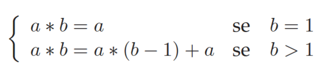

<<<<<<< HEAD
# Exercícios lab 01

Para relembrar a utilização de funções recursivas, realizamos diversos exercícios para praticar. LINGUAGEM: C.

    <big>1. Escreva uma função recursiva que calcula o produto de a * b, em que a e b são inteiros maiores que zero. considere que  o     produto pode ser definido como a somado a si mesmo b vezes, usando uma definição recursiva temos:</big>

----------

    <big>2. Escreva uma função recursiva, que devolve a soma dos n primeiros inteiros ímpares. Definição recursiva:</big>

----------

<big>3. Escreva uma função recursiva que calcule x^n. Definição recursiva:</big>

----------

<big>4. Usando as funções recursivas para calcular fatorial e potência, escrever a função recursiva que devolve o resultado da seguinte expressão:</big>

----------

<big>5. Dados um vetor de inteiros v (de n elementos), escreva uma função recursiva que inverta a posição dos seus elementos.</big>

----------

 Continuar a escrever aqui 

